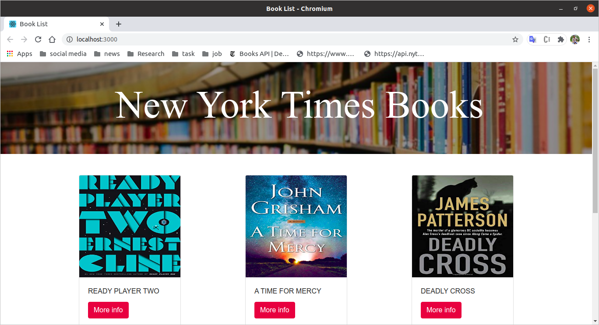
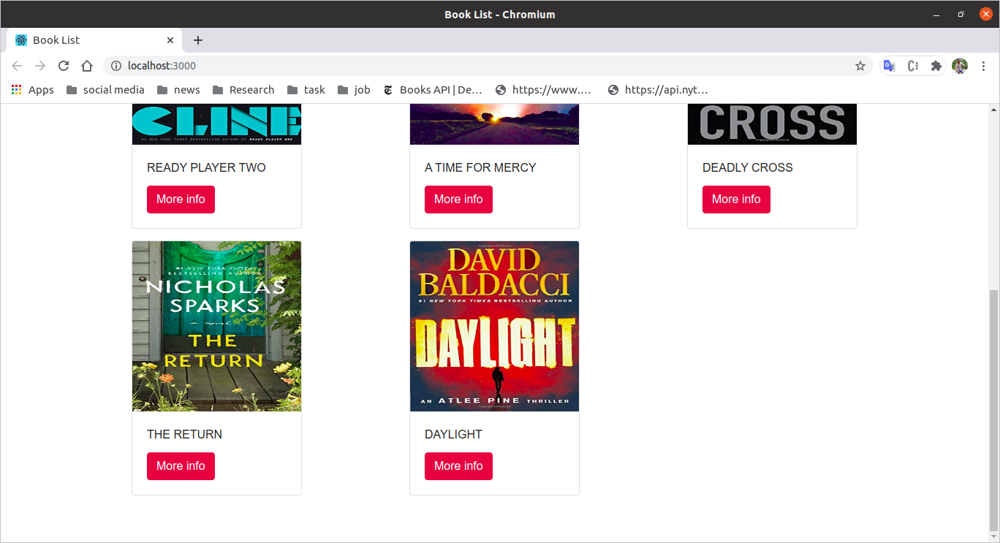
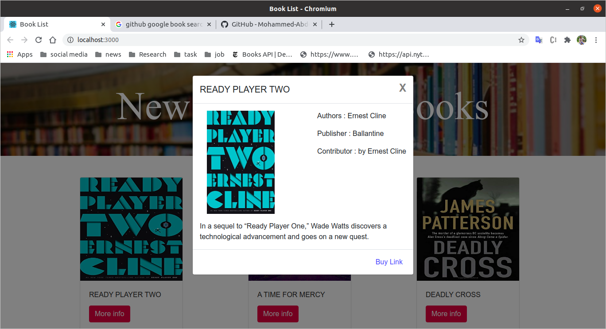

make sure that you have installed npm (https://www.npmjs.com/get-npm)

### `npm install`

open the terminal or cmd and navigate to the "Book List" folder
Run the command : npm install

### `npm start`

Run the command : npm start
Runs the app in the development mode. 
Open [http://localhost:3000](http://localhost:3000) to view it in the browser.

The page will reload if you make edits. 
You will also see any lint errors in the console.

## Learn More

You can learn more in the [Create React App documentation](https://facebook.github.io/create-react-app/docs/getting-started).

To learn React, check out the [React documentation](https://reactjs.org/).
